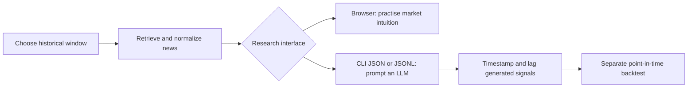

# News Search Engine

Search news from a chosen historical window through a browser, a
command-line interface (CLI), or an HTTP API. It exists to retrieve
time-limited news for two uses: studying markets as they looked at the time,
and feeding an AI agent only the articles published inside a fixed window.

The publication-date cutoff reduces **look-ahead bias** — using information
that was not available when a historical decision was made — but does not
remove it: archives are incomplete, timestamps may not match when
information became tradable, articles change after publication, and a large
language model may already know later events from training. A serious
backtest must apply the cutoff to every input, not only the news, and delay
signals until they could realistically have been traded.

This repository retrieves and exports news. It does not calculate returns,
simulate trades, report backtest performance, or summarize articles — there
is no LLM call anywhere in the code.

## What it does

- Queries GDELT, MediaCloud, ACLED, The New York Times, The Guardian, and
  NewsAPI for articles inside a start/end date window, in parallel, then
  normalizes and deduplicates the results.
- Serves three interfaces to the same search: a browser UI, a `news-search`
  CLI (table, JSON, or JSON Lines output), and an HTTP API.
- Reports per-source success/failure (`source_reports`) on every response, so
  a source that returned zero articles is distinguishable from a source that
  failed.
- Reports Google Trends search interest for the same query and window, in the
  browser, through `news-trends`, and at `GET /api/trends/interest`. A decision
  date rescales the series to what was known then, since Google's own scaling
  encodes a peak that had not yet happened.



## Requirements

- Python 3.13+
- `uv`
- Docker, optional, for the packaged deployment
- At least one complete sign-in account (`UI_USERNAME` / `UI_PASSWORD`); the
  server refuses every data request without one

Environment variables (set in `.env`, see `.env.example`):

- `UI_USERNAME` / `UI_PASSWORD`, plus optional `UI_USERNAME_2/3` and
  `UI_PASSWORD_2/3`: sign-in accounts, up to three, all with equal access
- `NEWS_SERVER_URL`: base URL `news-search` uses when `--server` is omitted
- `NYT_API_KEY`, `MEDIACLOUD_API_KEY`, `NEWSAPI_API_KEY`, `GUARDIAN_API_KEY`:
  per-source credentials — only needed for the sources you use; GDELT needs
  none
- `ACLED_OAUTH_TOKEN_URL`, `ACLED_OAUTH_GRANT_TYPE`, `ACLED_OAUTH_CLIENT_ID`,
  `ACLED_USERNAME`, `ACLED_PASSWORD`, plus the `ACLED_BEARER_*` fields that
  `scripts/acled_oauth_token.py` generates

## Setup

```bash
uv sync
cp .env.example .env   # set UI_USERNAME and UI_PASSWORD
uv run news-server
```

Open `http://127.0.0.1:8000`, sign in, choose the window, and search. The page
has three sections: build the search, review the archive, and compare it with
what people searched for over the same dates. `/docs` in the browser documents
what the tool can do, the commands an AI agent should call, the HTTP routes,
and the known limits.

## Usage

```bash
# start the server (add --reload for live-reload development)
uv run news-server

# readable table
uv run news-search "inflation" -s 2025-01-01 -e 2025-03-01

# every source page as one JSON response
uv run news-search "inflation" -s 2025-01-01 -e 2025-03-01 --all-pages --format json

# search attention (Google Trends) for the same query and window
uv run news-trends "central bank" -s 2015-01-01 -e 2015-06-30 --geo US
```

`uv run news-search --help` covers source filters, exact phrases, domain
filters, pagination, and file exports. `--server URL` (or `NEWS_SERVER_URL`)
points the CLI at a remote deployment; the CLI sends the sign-in account in a
header on every request, so use it only over TLS or a private VPN, never a
plain-HTTP public port.

`.agents/skills/news-cli/SKILL.md` is a skill file to copy into an AI agent's
own skills folder. It teaches the agent to sign in, run `news-search` and
`news-trends`, and check which providers actually answered before trusting a
result.

Run tests:

```bash
uv run python -m unittest discover -s tests -v
```

## Configuration

The server resolves settings in this order: `news-server --config PATH`, the
`NEWS_CONFIG` environment variable, `config.toml` in the current working
directory, then packaged defaults. Unknown keys, unknown source names, and
malformed TOML stop startup with a configuration error.

Key `[sources]` settings:

- `connect_timeout_seconds`: time to open a connection, including the TLS
  handshake — GDELT alone can need over ten seconds
- `read_timeout_seconds`: time to wait for a response once sent
- `mediacloud_collections`: MediaCloud collection IDs searched together
  (cannot be empty; `34412234` is "United States - National")

## Docker

```bash
docker network create single  # one time, if it does not already exist
docker compose up --build -d
```

Builds on `python:3.13-slim`, uses `uv`, Toronto time, loopback-only
publishing on `127.0.0.1:50024`, and the external `single` reverse-proxy
network. Configuration persists in `${HOME}/.containers/news`. Details in
[docs/user/DOCKER.md](docs/user/DOCKER.md).

## Layout

```text
src/news/       package: api, cli, search, sources/providers, trends, web (browser static files)
scripts/        one-off commands, e.g. ACLED OAuth token refresh
docs/user/      API reference, sign-in, and Docker docs
docs/reference/ generated OpenAPI schema and project structure reference
.agents/skills/ news-cli skill file for AI agents
```

See [GUIDE_ROOT.md](GUIDE_ROOT.md) and
[docs/reference/PROJECT_STRUCTURE.md](docs/reference/PROJECT_STRUCTURE.md)
for the full architecture.

## Output

The API returns JSON; the CLI can also write CSV, JSON, or SQLite. Every
response includes `source_reports` — per-source article counts and errors —
so partial failures are visible rather than silently lowering the count.

## Roadmap

**Fuzzy search.** Matching is exact today: a query for `Fed` misses `Federal
Reserve`, and a misspelled name returns nothing. Planned as local scoring over
what the providers return, not as a change to the provider queries — each
source has its own query language, and rewriting six of them would make results
harder to reproduce. The score, the threshold, and the matched terms belong in
the response, so a low-confidence match is visible rather than silently mixed
into the count.

**Better duplicate removal.** The current pass matches near-identical titles and
addresses, which catches an article syndicated verbatim but not two outlets
rewriting the same wire story. Planned as similarity over title and summary text
within the date window, keeping the earliest publication as the representative
and recording the ones it absorbed. Two things must hold: the merge has to stay
inside the window so it cannot pull in later coverage, and `--no-dedupe` has to
keep returning the raw set, since deciding what counts as the same story is a
research judgment rather than a detail to hide.

## License

All rights reserved. See [LICENSE](LICENSE).
