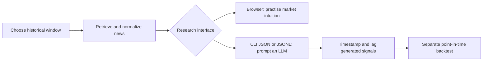

# News Search Engine

Search news from a specific historical period through a browser, a command-line interface (CLI), or an application programming interface (API).

## Purpose

This project supports two kinds of research:

1. **Study the news as it looked at the time:** choose a past window in the browser, form a view of the market, and compare that view with what happened later.
2. **Give an artificial intelligence (AI) agent time-limited news:** retrieve only the news published inside one historical window, without adding later coverage to the search results. The structured CLI output is designed for repeatable research and later experiments.

The publication-date limit helps reduce **look-ahead bias**: using information that would not have been available when a historical decision was made. It does not remove every source of bias. Archives can be incomplete, timestamps may not match when information became tradable, articles can change after publication, and a large language model (LLM) may already know later events from its training data. A serious backtest must apply the information cutoff to every input—not only the news—and delay signals until they could realistically have been traded.

This repository retrieves and exports news. It does not calculate returns, simulate trades, or report backtest performance.

## Roadmap

Planned work would make the browser a broader historical research workspace:

- Add macroeconomic data that was available during the selected period.
- Show the next configurable number of days of major financial and economic data releases in the browser.

### Not planned for now: news summaries

The project retrieves news; it does not summarize it, and no summary feature is
planned at the moment. There is no large language model (LLM) API call anywhere
in the code, and nothing here generates prose about the articles.

Artificial intelligence (AI) agents are still intended users, from the outside.
`.agents/skills/news-cli/SKILL.md` is a skill file written to be copied into an
agent's own skills folder. It teaches the agent to sign in to a deployment, run
`news-search` and `news-trends`, and check which providers actually answered
before trusting a result. The agent brings its own model, prompt, and key; this
project supplies the data and an honest account of what was retrieved.

Revisit a built-in summary only if something is needed that an outside agent
reading the structured output cannot already do.

## Search attention for the same window

`news-trends` and `GET /api/trends/interest` return how much the public
searched for the same keywords during the same dates as an article search.
Articles say what was published; this says what people were looking for,
including things the press had not covered yet.

```bash
uv run news-trends "central bank" -s 2015-01-01 -e 2015-06-30 --geo US
```

The values are Google's relative index from 0 to 100, never absolute counts,
and Google divides them by the peak of the whole window you asked for. That
means a series fetched for a long window tells its early days about a spike
that had not happened yet. Passing `--as-of 2015-03-01` drops the later points
and rescales to what was known on that date. `docs/html/google_trends_capabilities.html`
explains the measured example behind this and which Google functions still
work.

## Interfaces

| Interface | Intended user | Best for |
|---|---|---|
| Browser | Person | Exploring a fixed historical window, reading source context, and practising market intuition |
| CLI | LLM, script, or researcher | Repeatable searches, structured JavaScript Object Notation (JSON), JSON Lines (JSONL), and multi-page collection |
| `news-trends` CLI | Researcher or script | Search attention during the same window, as a table, JSON, or CSV |
| HTTP API | Application | Adding news retrieval to another research system |

The browser keeps the inclusive start and end dates visible as the information boundary. It can download the current source page as JSON or comma-separated values (CSV). The CLI supports a readable table for people, a complete JSON response for programs, and one article per line in JSONL for streaming workflows.

## Sources

The project has adapters for GDELT, MediaCloud, ACLED, The New York Times (NYT), The Guardian, and NewsAPI.

NYT and The Guardian are useful publisher sources because they offer documented developer APIs and broad archives. They are not assumed to be neutral, complete, or the only sources with free access. GDELT can run without credentials; the other configured adapters require source-specific keys or tokens. Provider plans, archive limits, licenses, and rate limits change, so check each provider’s current terms before using it for production or commercial research.

The packaged browser configuration selects NYT and The Guardian by default because they are recognizable publisher archives with consistent article details. That is a usability choice, not a claim that they are unbiased or uniquely free.

Several sources can improve coverage, but more sources do not automatically remove selection, geographic, editorial, survivorship, or language bias. Normalized results keep their source name so later research can measure or filter those differences.

## Quick start

Install dependencies, set a sign-in account, and start the browser application:

```bash
uv sync
cp .env.example .env   # set UI_USERNAME and UI_PASSWORD
uv run news-server
```

Open `http://127.0.0.1:8000`, sign in, choose the historical window, and search.

Every route that returns news data needs that account; without it the server
starts and refuses every request. Up to three accounts can be configured, using
`UI_USERNAME_2`, `UI_PASSWORD_2`, `UI_USERNAME_3`, and `UI_PASSWORD_3`, so
separate people can have separate passwords; they all reach the same routes.
`docs/user/SIGN_IN.md` explains how the passwords are stored and how the command
line signs in.

For live-reload development:

```bash
uv run news-server --reload
```

For a human-readable CLI result:

```bash
uv run news-search "inflation" -s 2025-01-01 -e 2025-03-01
```

For an LLM or another program, collect every available source page as JSON:

```bash
uv run news-search "inflation" \
  -s 2025-01-01 \
  -e 2025-03-01 \
  --all-pages \
  --format json
```

For a stream, emit one compact JSON article per line:

```bash
uv run news-search "central bank" \
  -s 2025-01-01 \
  -e 2025-01-31 \
  --format jsonl
```

Run `uv run news-search --help` for source filters, exact phrases, domain filters, pagination, direct mode, and file exports.

## Docker

The deployment uses Python 3.13 slim, `uv`, Toronto time, `restart: unless-stopped`, persistent configuration under `${HOME}/.containers/news` or the `NEWS_DATA_HOST_DIR` folder named in `.env`, loopback-only publishing, and the external `single` reverse-proxy network.

```bash
docker network create single  # one time, if it does not already exist
docker compose up --build -d news
```

Open `http://127.0.0.1:50023`. Host port `50023` avoids the podcast service’s `50022` default. On first boot, the container copies the repository `config.toml` into the persistent data directory. Later rebuilds preserve operator changes.

Before the first start, create the data directory and set `NEWS_UID` and `NEWS_GID` in `.env` to your own `id -u` and `id -g`. The container serves as an unprivileged account, so it must run as the owner of that directory:

```bash
mkdir -p ~/.containers/news
```

An AI agent can use the same CLI against a private remote deployment:

```bash
NEWS_SERVER_URL="https://news.example.com" \
uv run news-search "central bank" \
  -s 2026-01-01 \
  -e 2026-01-31 \
  --all-pages \
  --format json \
  --quiet
```

The explicit `--server URL` option overrides `NEWS_SERVER_URL`. The command line signs in with `UI_USERNAME` and `UI_PASSWORD`, the first configured account, on every request, so those credentials travel in a header. Send them only over an encrypted connection: put remote access behind a Transport Layer Security (TLS) reverse proxy or a private virtual private network (VPN), never a publicly exposed container port on plain HTTP.

See `docs/user/DOCKER.md` for configuration, operations, Dockerized CLI use, and the security boundary. `.agents/skills/news-cli/SKILL.md` is the skill file to copy into an AI agent's own skills folder so it can drive the CLI against a deployment. The accompanying local article is `blog/index.md`; it is not copied into the website repository.

## Configuration

Copy `.env.example` to `.env`, set `UI_USERNAME` and `UI_PASSWORD` (and the optional second and third accounts), and fill in credentials only for the sources you want to enable. Commands look for this file in the data directory, which is `NEWS_DATA_DIR` when set and the current working directory otherwise.

```bash
cp .env.example .env
```

For ACLED, add the OAuth login fields and generate a short-lived bearer token:

```bash
uv run python scripts/acled_oauth_token.py
```

The server resolves configuration in this order:

1. `news-server --config PATH`
2. the `NEWS_CONFIG` environment variable
3. `config.toml` in the current working directory
4. packaged defaults

An external file can override only the settings it needs. Unknown keys, unknown source names, malformed TOML, and non-positive cache limits stop startup with a configuration error.

## Research workflow



Treat an LLM-generated signal as a model output, not as evidence that a strategy works. Save the query, exact date window, selected sources, prompt, model version, and raw retrieved articles with each experiment. Apply transaction costs and realistic execution timing in the later backtest.

## Documentation

- API reference: `docs/user/API_REFERENCE.md`
- Sign-in and security: `docs/user/SIGN_IN.md`
- Docker deployment: `docs/user/DOCKER.md`
- Completed refactoring plan: `docs/plans/PROJECT_REFACTOR_PLAN.md`
- Developer structure reference: `docs/reference/PROJECT_STRUCTURE.md`

## Verification

```bash
uv run ruff check .
uv run python -m unittest discover -s tests -v
```

Lint rules live in `[tool.ruff]` in `pyproject.toml` and cover import ordering and modern-syntax rewrites, so the tool decides those mechanical details. Apply the fixes with:

```bash
uv run ruff check --fix .
```

When an intentional route or response-model change modifies the OpenAPI definition, review `docs/user/API_REFERENCE.md` and regenerate the schema:

```bash
uv run python scripts/generate_openapi.py
```
