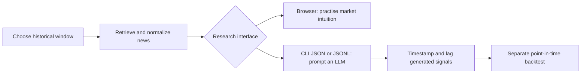

# News Search Engine

Search news from a chosen historical window through a browser, a command-line interface (CLI), or an application programming interface (API).

## Purpose

Two uses:

1. **Study the news as it looked at the time.** Pick a past window, form a view of the market, compare it with what happened later.
2. **Give an artificial intelligence (AI) agent time-limited news.** Retrieve only articles published inside the window, with no later coverage mixed in. Structured output makes runs repeatable.

The publication-date limit reduces **look-ahead bias**: using information that was not available when a historical decision was made. It does not remove it. Archives are incomplete, timestamps may not match when information became tradable, articles change after publication, and a large language model (LLM) may already know later events from training. A serious backtest must apply the cutoff to every input, not only the news, and delay signals until they could realistically have been traded.

This repository retrieves and exports news. It does not calculate returns, simulate trades, or report backtest performance. It also does not summarize articles; there is no LLM call anywhere in the code.

## Quick start

```bash
uv sync
cp .env.example .env   # set UI_USERNAME and UI_PASSWORD
uv run news-server
```

Open `http://127.0.0.1:8000`, sign in, choose the window, and search. Add `--reload` for live-reload development.

Every data route needs an account; without one the server starts and refuses every request. Up to three accounts are supported (`UI_USERNAME_2`, `UI_PASSWORD_2`, `UI_USERNAME_3`, `UI_PASSWORD_3`), all reaching the same routes. See `docs/user/SIGN_IN.md`.

## Docker

```bash
docker network create single  # one time, if it does not already exist
docker compose up --build -d
```

That starts the `news` service; the `news-cli` service sits behind the `cli` profile and is not started. To name the service explicitly:

```bash
docker compose up --build -d news
```

Open `http://127.0.0.1:50024`. Change the host port in `docker-compose.yml` if it is taken.

The deployment uses Python 3.13 slim, `uv`, Toronto time, `restart: unless-stopped`, loopback-only publishing, and the external `single` reverse-proxy network. Configuration persists in `${HOME}/.containers/news`, which the container creates on first boot, copying the repository `config.toml` in. Later rebuilds keep operator changes. Details in `docs/user/DOCKER.md`.

## CLI

```bash
# readable table
uv run news-search "inflation" -s 2025-01-01 -e 2025-03-01

# every source page as one JSON response
uv run news-search "inflation" -s 2025-01-01 -e 2025-03-01 --all-pages --format json

# one compact JSON article per line
uv run news-search "central bank" -s 2025-01-01 -e 2025-01-31 --format jsonl
```

`uv run news-search --help` covers source filters, exact phrases, domain filters, pagination, direct mode, and file exports.

Against a remote deployment:

```bash
NEWS_SERVER_URL="https://news.example.com" \
uv run news-search "central bank" -s 2026-01-01 -e 2026-01-31 --all-pages --format json --quiet
```

`--server URL` overrides `NEWS_SERVER_URL`. The CLI sends `UI_USERNAME` and `UI_PASSWORD` in a header on every request, so use it only over an encrypted connection: a Transport Layer Security (TLS) reverse proxy or a private virtual private network (VPN), never a public container port on plain HTTP.

`.agents/skills/news-cli/SKILL.md` is a skill file to copy into an AI agent's own skills folder. It teaches the agent to sign in, run `news-search` and `news-trends`, and check which providers actually answered before trusting a result. The agent brings its own model, prompt, and key.

## Search attention for the same window

`news-trends` and `GET /api/trends/interest` report how much the public searched for the same keywords over the same dates. Articles say what was published; this says what people were looking for, including what the press had not covered yet.

```bash
uv run news-trends "central bank" -s 2015-01-01 -e 2015-06-30 --geo US
```

Values are Google's relative index from 0 to 100, never absolute counts, and Google scales them to the peak of the whole window requested. A long window therefore tells its early days about a spike that had not happened yet. `--as-of 2015-03-01` drops the later points and rescales to what was known on that date. `docs/html/google_trends_capabilities.html` has the measured example.

## Interfaces

| Interface | Intended user | Best for |
|---|---|---|
| Browser | Person | Exploring one window, reading source context, practising market intuition |
| CLI | LLM, script, or researcher | Repeatable searches; JavaScript Object Notation (JSON), JSON Lines (JSONL), multi-page collection |
| `news-trends` CLI | Researcher or script | Search attention over the same window, as a table, JSON, or CSV |
| HTTP API | Application | Adding news retrieval to another research system |

The browser keeps the inclusive start and end dates visible as the information boundary and downloads the current page as JSON or comma-separated values (CSV).

## Sources

Adapters for GDELT, MediaCloud, ACLED, The New York Times (NYT), The Guardian, and NewsAPI. GDELT runs without credentials; the others need source-specific keys or tokens.

NYT and The Guardian are the packaged browser defaults because they are recognizable publisher archives with consistent article details. That is a usability choice, not a claim that they are neutral, complete, or uniquely free. More sources improve coverage but do not remove selection, geographic, editorial, survivorship, or language bias; normalized results keep their source name so later research can measure or filter those differences. Provider plans, archive limits, licenses, and rate limits change, so check current terms before production or commercial use.

## Configuration

Copy `.env.example` to `.env`, set the sign-in accounts, and fill in credentials only for the sources you want. Commands look for the file in the data directory: `NEWS_DATA_DIR` when set, otherwise the current working directory.

For ACLED, add the OAuth login fields and generate a short-lived bearer token:

```bash
uv run python scripts/acled_oauth_token.py
```

The server resolves configuration in this order:

1. `news-server --config PATH`
2. the `NEWS_CONFIG` environment variable
3. `config.toml` in the current working directory
4. packaged defaults

An external file can override only the settings it needs. Unknown keys, unknown source names, malformed TOML, and non-positive cache limits stop startup with a configuration error.

The `[sources]` table controls how adapters talk to providers:

| Setting | Meaning |
|---|---|
| `connect_timeout_seconds` | Time allowed to open a connection, including the Transport Layer Security (TLS) handshake. Some hosts need over ten seconds to negotiate TLS with GDELT, and a short limit fails the request before any data moves. |
| `read_timeout_seconds` | Time allowed to wait for a response once the request has been sent. |
| `mediacloud_collections` | MediaCloud collection identifiers searched together. A collection is a curated group of outlets. MediaCloud refuses a search that names none, so this list cannot be empty. `34412234` is "United States - National"; `34412476` is the United Kingdom, `34412118` India, `34412282` Australia. |

## When a source returns nothing

A search across six sources where four failed produces the same article count as a search where four simply had no matching articles. The two mean very different things for research on a fixed window, so failures are reported rather than hidden:

- Every response carries `source_reports`, one entry per requested source, with the number returned and any error.
- A request the server refuses outright, such as a reversed date window or an unknown source name, reports the server's own sentence rather than the status code.
- The CLI table prints a warning above the rows naming each failed source.
- JSON, JSON Lines, and file exports send the same warning to standard error, so the data stays parseable. `--quiet` turns it off.
- The message repeats what the provider said. NewsAPI names the earliest date the current plan allows; MediaCloud names the parameter it wanted; GDELT states its rate limit. Configured credentials are removed from that text before it is shown.

## Research workflow



Treat an LLM-generated signal as a model output, not as evidence that a strategy works. Save the query, exact date window, selected sources, prompt, model version, and raw retrieved articles with each experiment. Apply transaction costs and realistic execution timing in the later backtest.

## Roadmap

- Add macroeconomic data that was available during the selected period.
- Show the next configurable number of days of major financial and economic data releases in the browser.

## Verification

```bash
uv run ruff check .
uv run python -m unittest discover -s tests -v
```

Lint rules live in `[tool.ruff]` in `pyproject.toml` and cover import ordering and modern-syntax rewrites. Apply fixes with `uv run ruff check --fix .`.

When a route or response-model change modifies the OpenAPI definition, review `docs/user/API_REFERENCE.md` and regenerate the schema:

```bash
uv run python scripts/generate_openapi.py
```

## Documentation

- API reference: `docs/user/API_REFERENCE.md`
- Sign-in and security: `docs/user/SIGN_IN.md`
- Docker deployment: `docs/user/DOCKER.md`
- Developer structure reference: `docs/reference/PROJECT_STRUCTURE.md`
- Completed refactoring plan: `docs/plans/PROJECT_REFACTOR_PLAN.md`
- Local article: `blog/index.md` (not copied into the website repository)
