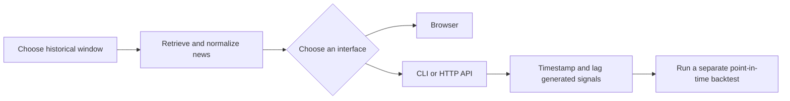

# Historical News Search

Search news from a fixed historical window through a browser, a command-line
interface (CLI), or an HTTP API. The project is for studying what information
was available at a past date and for giving an AI agent only articles published
inside a chosen window.

The publication cutoff reduces **look-ahead bias**: using information that was
not available when a historical decision was made. It cannot remove that risk.
Archives can be incomplete, timestamps may not match when information became
tradable, articles can change after publication, and a language model may know
later events from its training. A serious backtest applies the cutoff to every
input and delays signals until they could have been traded.

This project retrieves and exports data. It does not calculate returns,
simulate trades, or summarize articles. It makes no language-model calls.

## What it does

- Searches GDELT, MediaCloud, ACLED, The New York Times, The Guardian, and
  NewsAPI in parallel, then normalizes and deduplicates the results.
- Provides a browser, the `news-search` CLI, and an HTTP API for the same
  search.
- Includes a `source_reports` entry for every requested source, so zero matches
  and a failed request are not confused.
- Reports Google Trends search interest for the same query and dates in the
  browser, through `news-trends`, and at `GET /api/trends/interest`.



## Requirements

- Python 3.13 or newer
- `uv`
- Docker, optional, for the packaged deployment
- At least one account: `UI_USERNAME` and `UI_PASSWORD`

The server refuses data requests until an account is configured. Set these
values in `.env` (see `.env.example`):

- `UI_USERNAME` / `UI_PASSWORD`, with optional `_2` and `_3` pairs for up to
  three accounts
- `NEWS_SERVER_URL`, the CLI's default server address
- `NYT_API_KEY`, `MEDIACLOUD_API_KEY`, `NEWSAPI_API_KEY`, and
  `GUARDIAN_API_KEY`, only for the providers you use; GDELT needs no key
- ACLED's OAuth settings: `ACLED_OAUTH_TOKEN_URL`,
  `ACLED_OAUTH_GRANT_TYPE`, `ACLED_OAUTH_CLIENT_ID`, `ACLED_USERNAME`,
  `ACLED_PASSWORD`, and the `ACLED_BEARER_*` fields created by
  `scripts/acled_oauth_token.py`

## Setup

```bash
uv sync
cp .env.example .env   # set UI_USERNAME and UI_PASSWORD
uv run news-server
```

Open `http://127.0.0.1:8000`, sign in, choose a date window, and search. The
`/docs` page explains the interfaces, commands, routes, and known limits.

## Usage

```bash
# Start the server. Add --reload during development.
uv run news-server

# Readable table
uv run news-search "inflation" -s 2025-01-01 -e 2025-03-01

# One JSON response containing every page
uv run news-search "inflation" -s 2025-01-01 -e 2025-03-01 --all-pages --format json

# Google Trends search interest for the same kind of window
uv run news-trends "central bank" -s 2015-01-01 -e 2015-06-30 --geo US
```

Run `uv run news-search --help` for source filters, phrase matching, domain
filters, pagination, and exports. Use `--server URL` or `NEWS_SERVER_URL` for a
remote deployment. The CLI sends the account in an HTTP header on every
request, so use TLS or a private VPN; never expose a plain-HTTP public port.

`.agents/skills/news-cli/SKILL.md` is an optional skill file for an outside AI
agent. It explains sign-in, both commands, and provider-coverage checks. The
agent supplies its own model, prompt, and key.

Run the tests with:

```bash
uv run python -m unittest discover -s tests -v
```

## Configuration

The server reads settings in this order:

1. `news-server --config PATH`
2. `NEWS_CONFIG`
3. `config.toml` in the current directory
4. Packaged defaults

Unknown keys, source names, or malformed TOML stop startup.

Useful `[sources]` settings:

- `connect_timeout_seconds`: time to open a connection, including the TLS
  handshake; GDELT can need more than ten seconds
- `read_timeout_seconds`: time to wait for a response after sending a request
- `mediacloud_collections`: MediaCloud collection IDs; the list cannot be empty

## Docker

```bash
docker network create single  # one time, if needed
docker compose up --build -d
```

The deployment uses `python:3.13-slim`, `uv`, Toronto time, loopback-only
publishing on `127.0.0.1:50024`, and the external `single` reverse-proxy
network. Settings persist in `${HOME}/.containers/news`. See
[docs/user/DOCKER.md](docs/user/DOCKER.md).

## Layout

```text
src/news/       package: API, CLI, search, providers, trends, and browser files
scripts/        small commands, including ACLED token refresh
docs/user/      API, sign-in, and Docker documentation
docs/reference/ generated OpenAPI schema and project structure
.agents/skills/ news-cli instructions for AI agents
```

Start with [GUIDE_ROOT.md](GUIDE_ROOT.md) and
[docs/reference/PROJECT_STRUCTURE.md](docs/reference/PROJECT_STRUCTURE.md).

## Output

The API returns JSON. The CLI can also write a table, CSV, JSON, JSON Lines, or
SQLite. Every response includes `source_reports`, which shows each provider's
article count and any error.

## Roadmap

**Fuzzy search.** Current matching is exact: `Fed` does not match `Federal
Reserve`, and misspellings return nothing. A future local matching pass should
show its score, threshold, and matched terms instead of hiding low-confidence
matches in the result count.

**Better duplicate removal.** Current matching catches near-identical titles
and addresses, including verbatim syndication, but often keeps rewritten wire
stories. A future text-similarity pass should keep the earliest article and
record what it absorbed. It must stay inside the requested window, and
`--no-dedupe` must continue to return the raw set.

## License

All rights reserved. See [LICENSE](LICENSE).
