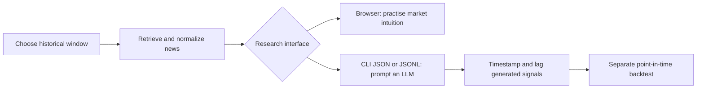

# News Search Engine

Retrieve news published within a specific historical period through a FastAPI
application programming interface (API), a browser interface, or a command-line
interface (CLI).

## Purpose

The project has two purposes:

1. **Train human market intuition from news:** use the browser to study the news
   available during a past period, form a view of the market at that point, and
   compare that view with what happened afterward.
2. **Give an artificial intelligence (AI) agent point-in-time news:** let an
   agent retrieve news from one specific historical period without exposing it
   to later news. The structured command-line interface (CLI) output supports
   reproducible agent research and downstream experiments.

Restricting news by publication date helps reduce **look-ahead bias**, which
means using information that would not have been available when a historical
decision was made. It does not remove every source of bias. Provider archives
can be incomplete, publication timestamps may differ from the time information
became tradable, articles can be revised, and an LLM may already know later
events from its training data. A serious backtest must enforce the information
cutoff for every input—not only the retrieved news—and lag signals until they
could realistically have been acted on.

This repository retrieves and exports news. It does not currently calculate
returns, simulate trades, or report backtest performance.

## Roadmap

Planned next steps focus on making the browser a richer point-in-time research
workspace:

- Add historical Google Trends data for the selected period.
- Add macroeconomic data that was available during the selected period.
- Add an AI-agent news summary, produced through a large language model (LLM)
  API call, to the browser and optionally to the CLI.
- Show the next configurable number of days of major financial and economic
  data releases in the browser.

## Interfaces

| Interface | Intended user | Best for |
|---|---|---|
| Browser front end | Person | Exploring a fixed historical window, reading provider context, and practising market intuition |
| CLI | LLM, script, or researcher | Reproducible searches, structured JavaScript Object Notation (JSON), JSON Lines (JSONL), and multi-page collection |
| HTTP API | Application | Integrating retrieval into another research system |

The browser keeps the inclusive start and end dates visible as the information
boundary. It can download the current provider page as JSON or comma-separated
values (CSV). The CLI supports a readable table for people, a complete JSON
payload for tools, and one article per line in JSONL for streaming workflows.

## Providers

The project is not limited to The New York Times (NYT) and The Guardian. It has
adapters for GDELT, MediaCloud, ACLED, NYT, The Guardian, and NewsAPI.

NYT and The Guardian are useful publisher sources because they expose
documented developer APIs and broad archives. They are not assumed to be
neutral, complete, or the only providers with free access. GDELT can run here
without credentials; the other configured adapters require provider-specific
keys or tokens. Provider plans, historical-depth limits, licensing, and
rate limits change, so verify each provider's current terms before relying on
it for production or commercial research.

The packaged browser configuration selects NYT and The Guardian by default
because they are recognizable publisher archives with consistent article
metadata. That default is a usability choice, not a claim that they are
unbiased or uniquely free.

Using several providers can improve coverage, but adding sources does not by
itself eliminate selection, geographic, editorial, survivorship, or language
bias. The normalized results retain their source so downstream research can
measure or filter those differences.

## Quick Start

Install dependencies and start the browser application:

```bash
uv sync
uv run news-server
```

Open `http://127.0.0.1:8000`, choose the historical window, and search.

For a human-readable CLI result:

```bash
uv run news-search "inflation" -s 2025-01-01 -e 2025-03-01
```

For an LLM or another program, collect every available provider page as JSON:

```bash
uv run news-search "inflation" \
  -s 2025-01-01 \
  -e 2025-03-01 \
  --all-pages \
  --format json
```

For a streaming pipeline, emit one compact JSON article per line:

```bash
uv run news-search "central bank" \
  -s 2025-01-01 \
  -e 2025-01-31 \
  --format jsonl
```

Run `uv run news-search --help` for source filters, exact phrases, domain
filters, pagination, direct mode, and file exports.

## Configuration

Copy `.env.example` to `.env` and fill in credentials only for the providers
you want to enable. Commands look for this optional file in the current working
directory.

```bash
cp .env.example .env
```

For ACLED, add the OAuth login fields and generate a short-lived bearer token:

```bash
uv run python scripts/acled_oauth_token.py
```

The server resolves configuration in this order:

1. `news-server --config PATH`
2. the `NEWS_CONFIG` environment variable
3. `config.toml` in the current working directory
4. packaged defaults

An external file can override only the settings it needs. Unknown keys, unknown
source names, malformed TOML, and non-positive cache limits stop startup with a
configuration error.

## Research Workflow



Treat an LLM-generated signal as a model output, not as evidence that a strategy
works. Save the query, exact date window, selected providers, prompt, model
version, and raw retrieved articles with each experiment. Apply transaction
costs and realistic execution timing in the downstream backtest.

## Documentation

- API reference: `docs/user/API_REFERENCE.md`
- Completed refactoring plan: `docs/plans/PROJECT_REFACTOR_PLAN.md`
- Developer structure reference: `docs/reference/PROJECT_STRUCTURE.md`

## Verification

```bash
uv run ruff check .
uv run python -m unittest discover -s tests -v
```

When an intentional route or response-model change modifies the OpenAPI
contract, review `docs/user/API_REFERENCE.md` and regenerate the schema:

```bash
uv run python scripts/generate_openapi.py
```
