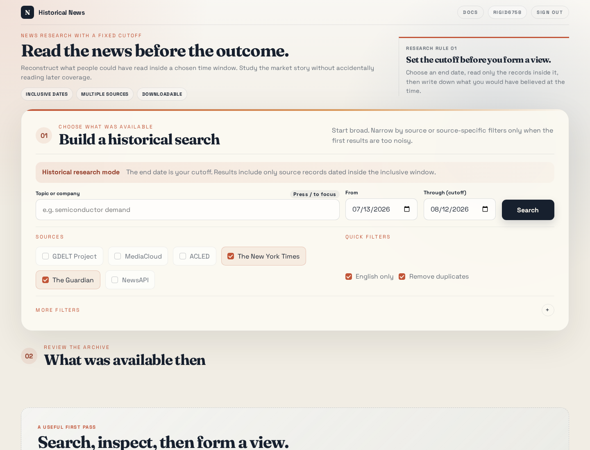

# Lire les nouvelles avant de connaître le résultat

La plupart des recherches de marché commencent avec un avantage caché : nous savons déjà ce qui s'est passé. Une fois le résultat connu, les anciens titres semblent plus révélateurs et les signes avant-coureurs plus évidents qu'ils ne l'étaient en temps réel.

J'ai créé [Historical News](https://github.com/GerardWu100/news) pour réduire une partie de cet avantage. Le service interroge plusieurs archives sur une période historique fixe, impose une date limite explicite à chaque recherche et rend la même recherche accessible dans un navigateur, par une interface en ligne de commande (CLI) et par une interface de programmation d'application HTTP (API).

Le projet remplit deux fonctions. L'interface web sert d'environnement d'entraînement pour une personne qui veut développer son intuition de marché. L'interface machine fournit des données limitées dans le temps à un agent d'intelligence artificielle (IA), qui prédit ensuite un résultat de marché futur dans un backtest chronologique. Le service ne produit pas la prédiction et n'exécute pas le backtest; il contrôle l'une de leurs données d'entrée les plus importantes.



Le navigateur garde la règle de recherche à l'écran : choisir la date limite avant de former une opinion. Il affiche aussi les dates actives, les sources sélectionnées et le réglage de suppression des doublons.

## Une couche de collecte, deux méthodes de recherche

La couche commune interroge GDELT, MediaCloud, ACLED, The New York Times, The Guardian et NewsAPI. Les réponses sont converties dans un même format d'article, filtrées, éventuellement dédoublonnées, triées, puis accompagnées d'un rapport pour chaque source demandée. Google Trends ajoute une mesure distincte de ce que le public recherchait pendant la même période.

**Parcours humain :** sources historiques → collecte limitée dans le temps → exercice dans le navigateur → opinion de marché → révélation du résultat ultérieur.

**Parcours IA :** sources historiques → collecte limitée dans le temps → CLI ou API HTTP → prédiction de l'agent IA → backtest chronologique séparé.

Cette couche partagée est utile parce qu'une personne et un agent peuvent examiner la même requête, les mêmes dates, les mêmes articles, les mêmes échecs de sources et le même nombre de doublons. Leurs conclusions diffèrent alors à cause de leur méthode de recherche, et non parce qu'ils utilisent deux chaînes de données non documentées.

Le chemin principal de la recherche reste volontairement simple :

```python
raw_articles, source_reports = await executor(
    source_options,
    request.source_names,
)

filtered_articles = apply_post_filters(raw_articles, request)

if request.deduplicate:
    processed_articles = deduplicate_articles(filtered_articles)
else:
    processed_articles = filtered_articles

sorted_articles = sort_articles(processed_articles, request.sort_order)
```

La sortie `source_reports` compte autant que la liste d'articles. Une source fonctionnelle qui ne renvoie aucun résultat et une source en panne qui ne renvoie rien sont deux observations différentes. Un backtest qui les confond peut transformer une panne de données en signal de trading.

## Ce que comprend l'implémentation actuelle

L'idée de recherche n'est utile que si le service est assez fiable pour une utilisation interactive comme pour des requêtes répétées. L'implémentation actuelle comprend donc les éléments opérationnels qui entourent la recherche :

- Les six fournisseurs sont interrogés en parallèle. La panne d'un fournisseur n'efface pas les résultats des autres, et chaque source demandée reçoit son propre rapport d'état.
- Le navigateur, la CLI et l'API HTTP partagent la même validation, les mêmes filtres, le même dédoublonnage, le même tri et le même format d'article normalisé. Des requêtes identiques déjà en cours partagent une seule interrogation des fournisseurs, tandis qu'un cache de courte durée limite l'utilisation répétée de leurs quotas.
- Chaque route qui renvoie des nouvelles exige un compte. Le navigateur utilise un cookie de session, la CLI utilise l'authentification HTTP Basic, et des verrous de fichiers gardent les sessions et les limites de tentatives infructueuses cohérentes entre les processus du serveur.
- Les résultats peuvent être téléchargés en CSV ou en JSON depuis le navigateur et exportés sous forme de tableaux, de fichiers CSV, JSON, JSON Lines ou SQLite avec la CLI. Le format JSON Lines place un enregistrement JSON sur chaque ligne, ce qui facilite le traitement progressif de grands résultats.
- Le paquet fonctionne avec Python 3.13 et peut être installé avec `uv` ou déployé avec Docker. La configuration Compose fournie publie uniquement sur l'interface loopback de l'hôte au port 50024; l'accès public doit passer par un proxy protégé par Transport Layer Security (TLS) ou par un réseau privé.

Il ne s'agit pas de produits distincts. Ce sont plusieurs points d'entrée vers les mêmes règles de collecte, ce qui permet de reproduire plus tard, dans du code, un exercice réalisé dans le navigateur.

## Première fonction : entraîner l'intuition de marché

Ici, **l'intuition de marché** désigne la capacité à formuler une opinion vérifiable à partir d'informations incomplètes : ce qui compte, ce que le marché anticipe peut-être déjà, les éléments qui se contredisent et les faits qui feraient changer d'avis. Cela ne veut pas dire que l'instinct doit remplacer la mesure.

Un exercice utile comporte quatre étapes :

1. Choisir une entreprise, un sujet et une date limite historique.
2. Lire uniquement les articles datés de la période permise et vérifier quelles sources ont répondu.
3. Noter une prédiction, un niveau de confiance, un horizon et les faits qui l'invalideraient.
4. Révéler ensuite le parcours du prix ou la publication économique, évaluer la prédiction et consigner ce qui a été manqué.

Par exemple, un chercheur peut s'arrêter à la date de publication de résultats financiers, lire les 30 jours précédents et prévoir les cinq séances suivantes avant d'ouvrir le graphique. La répétition crée une rétroaction concrète. Elle révèle aussi des habitudes que la lecture rétrospective masque : donner trop de poids à un article marquant, prendre plusieurs copies d'une même dépêche pour des confirmations indépendantes ou modifier la prévision après avoir vu le résultat.

L'interface web soutient directement cet exercice. La date limite fait partie de la recherche, les filtres avancés restent disponibles lorsqu'une requête générale produit trop de bruit et la page de résultats indique la couverture de chaque source. Le panneau Google Trends ajoute une autre question : l'attention du public a-t-elle changé avant le récit médiatique?

## Deuxième fonction : alimenter le backtest d'un agent IA

La deuxième méthode remplace le navigateur par la CLI ou l'API HTTP. À chaque date de décision historique $d$, un agent externe reçoit uniquement les articles dont la date de publication n'est pas postérieure à $d$. Il produit une prévision sur un horizon ultérieur. Un backtest séparé enregistre le signal, applique un délai d'exécution et mesure le rendement qui suit.

Une boucle chronologique minimale suit ces étapes :

1. Fixer la date de décision $d$ et récupérer la période de nouvelles autorisée qui se termine à $d$.
2. Conserver la réponse brute, la requête, les rapports de sources, le modèle de l'agent et son prompt.
3. Demander à l'agent une prévision qui précise la direction, l'horizon, la confiance et les faits qui l'invalideraient.
4. Transformer la prévision en position seulement après un délai réaliste, puis l'évaluer avec les prix ultérieurs.
5. Avancer $d$ et recommencer sans modifier les sorties antérieures.

Cette méthode permet notamment de tester si un agent peut prévoir la direction du marché du lendemain à partir des nouvelles de la semaine précédente, ou si son niveau de confiance contient de l'information sur l'ampleur du mouvement ultérieur. La cible exacte, l'univers d'actifs, les coûts de transaction et la mesure d'évaluation appartiennent au backtest, pas au service de collecte.

Cette séparation est volontaire. Lorsque la collecte, le prompt, les règles de portefeuille et le calcul de performance se trouvent dans un seul processus opaque, un bon résultat est difficile à expliquer. Une frontière de collecte fixe permet de tester l'agent tout en gardant les éléments historiques vérifiables.

## Google Trends exige son propre traitement temporel

Google Trends publie un indice relatif de 0 à 100, et non un nombre de recherches. Sa méthode de normalisation peut introduire une forme moins visible de biais d'anticipation.

Définissons $v_t$ comme le volume de recherche non observé au temps $t$. La période demandée est $W=[s,e]$, où $s$ représente la date de début et $e$ la date de fin. Définissons $m_W=\max_{u \in W} v_u$ comme le volume maximal sur cette période. Google renvoie l'indice $I_t$ :

$$
I_t = 100 \times \frac{v_t}{m_W}.
$$

Si la décision est prise à la date $d$, les valeurs postérieures à $d$ n'étaient pas encore connues. Définissons $m_d=\max_{u \in [s,d]}v_u$ comme le maximum disponible à la date de décision. Le service supprime les observations ultérieures et change l'échelle de l'indice observé :

$$
\begin{aligned}
\widetilde{I}_t
&= 100 \times \frac{I_t}{\max_{u \in [s,d]} I_u} \\
&= 100 \times \frac{100v_t/m_W}{100m_d/m_W} \\
&= 100 \times \frac{v_t}{m_d}, \qquad t \le d.
\end{aligned}
$$

Ici, $\widetilde{I}_t$ est l'indice remis à l'échelle avec les seules informations disponibles à la date $d$. La deuxième ligne remplace le numérateur et le dénominateur par la définition de $I_t$. Le facteur commun $m_W$, calculé sur toute la période, s'annule à la troisième ligne.

Cette correction préserve la forme relative des valeurs renvoyées par Google. Elle ne peut pas recréer la précision perdue lorsque Google a arrondi de petites valeurs. Il reste donc plus prudent de demander une période qui se termine près de $d$.

## Ce que la date limite ne résout pas

Les dates de publication réduisent le biais d'anticipation; elles ne prouvent pas que chaque donnée était exploitable à cet instant. Un article peut avoir été modifié après sa publication. Les archives peuvent être incomplètes. Les horodatages des fournisseurs peuvent avoir des sens différents. Un modèle de langage peut déjà connaître l'événement futur grâce à ses données d'entraînement.

Pour soutenir une conclusion applicable au trading, le backtest doit aussi séparer l'heure d'observation, l'heure de collecte, l'heure de décision, l'heure de l'ordre et l'heure d'exécution. Il lui faut une période de test chronologique laissée intacte, des coûts réalistes et une trace de chaque variation du prompt ou de la stratégie. Sans ces précautions, la méthode peut surajuster l'échantillon historique même si tous les articles respectent la date limite.

Historical News fournit la frontière d'information et la trace d'audit nécessaires pour commencer ce travail. Son navigateur transforme l'histoire des marchés en exercice délibéré pour une personne. Ses interfaces machine rendent les mêmes données réutilisables par un agent. Le code source et les instructions d'installation se trouvent dans le [GitHub repository](https://github.com/GerardWu100/news).
