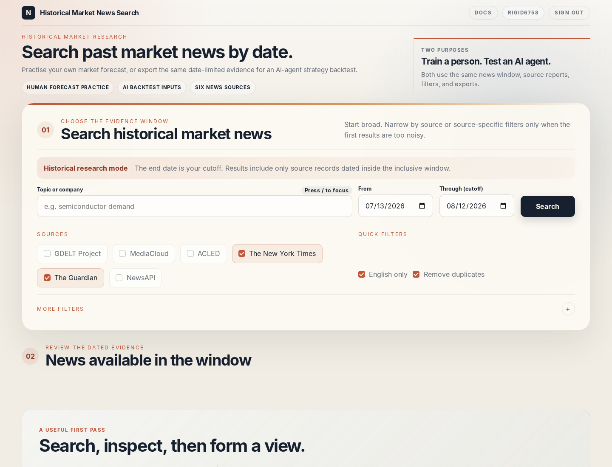

# Recherche de nouvelles historiques sur les marchés

Ce projet remplit deux fonctions :

1. **Entraîner l'intuition de marché :** s'arrêter à une date passée, lire uniquement les nouvelles disponibles à ce moment, faire une prévision, puis révéler le résultat.
2. **Tester les stratégies d'agents IA :** fournir les mêmes nouvelles limitées dans le temps à un agent d'intelligence artificielle (IA), puis transmettre sa prévision à un backtest séparé.

Dépôt : [github.com/GerardWu100/news](https://github.com/GerardWu100/news)

L'interface web affiche d'abord ces deux usages, puis la requête, la date limite, les sources et les filtres.

## Ce que l'outil permet de faire

Rechercher `semiconductor demand` du 1er au 31 juillet, sélectionner The New York Times et The Guardian, conserver les articles en anglais et supprimer les doublons. Le résultat contient :

- Les articles datés de cette période, classés du plus récent au plus ancien ou dans l'ordre inverse.
- Un rapport par source : disponible, en panne, aucun résultat, nombre d'articles et présence d'une autre page.
- Des téléchargements JSON et CSV qui conservent la requête et les filtres actifs.
- Une adresse partageable qui restaure la même recherche dans le navigateur.

D'autres contrôles filtrent par expression exacte, termes exclus, domaines inclus ou exclus, section, rubrique du New York Times, tag du Guardian et champ NewsAPI. La recherche fonctionne dans le navigateur, avec l'interface en ligne de commande (CLI) `news-search` ou par l'interface de programmation d'application HTTP (API).

La CLI peut regrouper plusieurs pages et exporter un tableau, un fichier CSV, JSON, JSON Lines ou SQLite. JSON Lines place un article sur chaque ligne, ce qui facilite le traitement de grands résultats par un agent.

Google Trends affiche l'intérêt de recherche relatif pour les mêmes mots et les mêmes dates. Une date de décision facultative retire les observations ultérieures avant de recalculer le graphique.

## Sources

- **GDELT Project :** index mondial ouvert; aucune clé API.
- **The New York Times Article Search API :** `NYT_API_KEY`.
- **The Guardian Open Platform :** `GUARDIAN_API_KEY`.
- **NewsAPI :** `NEWSAPI_API_KEY`.
- **MediaCloud API :** `MEDIACLOUD_API_KEY` et collections de médias sélectionnées.
- **ACLED API :** événements de conflit et de manifestation accessibles avec OAuth.

Le service interroge les sources sélectionnées en parallèle et convertit leurs réponses dans un même format d'article. La panne d'une API ne masque pas les résultats des autres.

## Méthode humaine

Choisir une ancienne date de résultats financiers. Rechercher les 30 jours précédents. Noter la direction attendue, l'horizon de cinq séances, la confiance et les faits qui invalideraient la prévision. Ouvrir ensuite seulement le graphique des prix.

La répétition rend les erreurs visibles : un titre marquant a reçu trop de poids, cinq copies d'une dépêche ont semblé être cinq confirmations, ou la prévision a changé après la révélation du résultat.

## Méthode par agent IA

Pour chaque date de décision historique, conserver la requête, les articles, les rapports de sources, le modèle, le prompt et la prévision. Exécuter la transaction seulement après un délai réaliste de collecte et de traitement. Le service fournit les données; l'agent externe prévoit; le backtest séparé gère les positions, les coûts et les rendements.

## Feuille de route

- **Mouvement des actifs clés :** afficher le prix de l'actif pertinent pendant la période recherchée et après celle-ci. Masquer le mouvement postérieur à la date limite jusqu'à l'enregistrement de la prévision humaine et l'exclure des données fournies à l'agent IA.
- **Résumé IA intégré :** résumer uniquement les articles renvoyés, relier chaque affirmation à ses sources et conserver la période, les pannes de fournisseurs, le modèle, le prompt et la sortie.
- **Contexte macroéconomique :** ajouter les taux directeurs, l'inflation, le chômage, la croissance du produit intérieur brut et les niveaux de la courbe des taux pour la période recherchée. Utiliser uniquement les chiffres publiés à la date de décision et conserver les versions historiques lorsque les données ont été révisées.
- **Meilleurs résultats de recherche :** rapprocher des termes liés comme `Fed` et `Federal Reserve`, tolérer les fautes, afficher le score de correspondance et regrouper les versions réécrites d'une même dépêche en conservant la première publication.

Historical Market News Search récupère et exporte les données. Il ne résume pas les articles, n'appelle pas de modèle de langage et n'exécute pas le backtest de stratégie.
