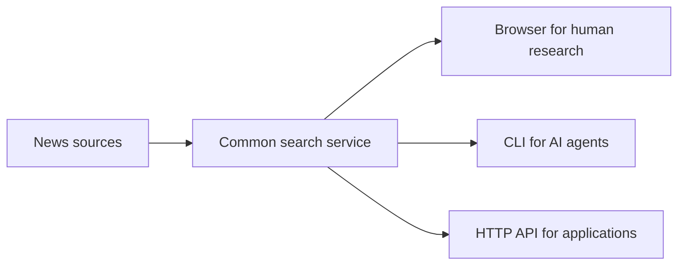

# A News Research Service for Both Humans and AI Agents

News research has an awkward interface problem. A person wants a browser with
visible dates, source controls, readable headlines, and links worth opening. An
artificial intelligence (AI) agent wants almost the opposite: a stable command,
structured output, clear search details, and no hidden state.

The useful design is to put one search engine behind three small interfaces:



The browser and command-line interface (CLI) then share the same validation,
source adapters, filtering, duplicate removal, and date cutoff. That common
core matters more than the interface: a result inspected by a person and a
result summarized by an agent were produced under the same rules.

## The date is part of the result

For historical research, the end date is not a cosmetic filter. It is the
cutoff: the latest publication date the search is allowed to include.

That restriction helps reduce **look-ahead bias**, which occurs when a
historical decision uses information that was not available at the time. It
does not eliminate the problem. Sources can revise articles, archives can be
incomplete, timestamps may not match the moment information became tradable,
and a large language model (LLM) may know later events from training.

The practical rule is simple: every summary should repeat its query, inclusive
date window, source coverage, result count, and source failures. A polished
paragraph without that search context is less useful than it looks.

## Why Docker helps

The application already runs as an installable Python package. Docker adds an
operational boundary around it:

- Python 3.13 and dependencies are fixed by the image and `uv.lock`.
- Source credentials enter through environment variables rather than the
  image.
- A mounted data directory owns the editable `config.toml`.
- A health check confirms that the configuration endpoint responds.
- `restart: unless-stopped` brings the service back after a host restart.
- The host publishes only `127.0.0.1:50023`, so the API is not accidentally
  exposed to the internet.

The container seeds `${HOME}/.containers/news/config.toml` only on first boot.
This is a small but important detail. Defaults are convenient on day one, while
operator changes survive later image rebuilds.

The Compose service also joins an external network called `single`. An existing
reverse proxy can reach the container on that network without publishing the
application port broadly. Remote access should pass through an authenticated
Transport Layer Security (TLS) proxy or a private virtual private network
(VPN). The news application does not implement its own user accounts, and an
open endpoint could let strangers spend the configured source quotas.

## One CLI, local or remote

The agent-facing interface is the `news-search` command. Locally, its default
server is `http://localhost:8000`. For a remote Docker deployment, the same
command reads `NEWS_SERVER_URL`:

```bash
NEWS_SERVER_URL="https://news.example.com" \
uv run news-search "central bank policy" \
  --start 2026-01-01 \
  --end 2026-01-31 \
  --english \
  --all-pages \
  --max-pages 10 \
  --format json \
  --quiet
```

The output contains two objects. `results` holds normalized articles. `meta`
holds the query, dates, page state, duplicate count, requested sources, and a
report for each source. JSON Lines (JSONL), where each line is one JSON record,
is useful for streaming. Full JSON is better for research summaries because it
retains the details needed to judge coverage.

The `--max-pages` option is not mere caution. Broad news queries can create
large, expensive inputs for an LLM. A page limit makes the retrieval budget
visible and prevents an agent from turning a vague request into an unbounded
collection job.

## The service retrieves; it does not summarize

The service contains no model of its own. There is no API call to a language
model, no prompt, and no generated prose about the articles. An agent reads the
same JSON any other program would and does its own work with it.

What the repository does ship is a skill file: a short set of operating
instructions meant to be copied into an agent's own skills folder. It covers
signing in to a deployment, running the commands, and checking which providers
actually answered. It deliberately stops there and does not ask for a summary.

That split is deliberate rather than a gap waiting to be filled. Retrieval and
interpretation fail in different ways and are best fixed separately: a missing
source is a retrieval bug, while an overconfident paragraph is a prompt problem.
Keeping them apart means the model choice, the wording, and the API key belong
to whoever runs the agent, and this project stays responsible for one thing.

What the service does provide is the material an honest summary needs. Every
response carries a `meta` block naming the date boundary, which sources answered,
which failed, how many duplicates were removed, and whether more pages exist. An
agent that reads that block before the articles can tell the difference between
"nothing was published" and "two sources timed out", which is the distinction a
confident narrative usually hides.

## What the service still does not prove

The system retrieves news; it does not establish truth, causal impact, or a
profitable trading signal. Repeated syndicated headlines are not independent
confirmation. Provider snippets are not full-article review. Publication dates
are not guaranteed tradability timestamps. Deduplication is useful for input
quality, but it can also hide how widely one wire story was republished.

Those limitations suggest the next layer of work:

- archive the raw response beside every generated summary;
- record the model and prompt used for the summary;
- lag any derived signal until it could realistically be acted on;
- test sensitivity to provider choice and query wording;
- keep market returns and backtests outside the retrieval service.

The larger lesson is architectural. Human research and agent research do not
need separate data systems. They need a shared, inspectable retrieval boundary
and interfaces designed for their different ways of working.
