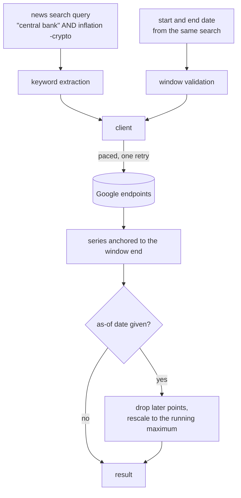

# GUIDE_trends

## Part 1 -- Conceptual Explanation

### Purpose

This package answers one question: during the same past window an article
search covers, how much did the public search for the same keywords? Articles
say what was published; this says what people were looking for, including
things the press had not covered yet. The gap between the two is the reason the
signal is worth having, and it only means something when both sides cover
identical dates.

The scope is deliberately one capability. Google Trends offers more, but the
project studies past windows, so anything describing the present moment is
useless here. That decision is recorded with live evidence in
`docs/html/google_trends_capabilities.html`, which was re-tested against the
endpoints on 2026-08-10. In short: every Google function reporting what is
popular right now returns HTTP 404 today, and every function that accepts a
date window still works. The project uses one of the survivors.

### What the numbers mean

Google returns a relative index from 0 to 100, never absolute search counts.
The value 100 marks the highest search volume inside the window that was
requested, and everything else is scaled against that one peak. Two
consequences shape every design decision here:

- A stored series is meaningless without the window it came from. The same day
  can read 100 or 30 depending on how far past it the request reached.
- Keywords requested together share one scale, which is the only way to compare
  them. Up to five fit in one request.

A zero can mean "below Google's reporting threshold" rather than "nobody
searched it", and older windows are more exposed to that because a term common
now may have been rare then.

### The look-ahead problem, and the fix

This is the part that is easy to get wrong and hard to notice. Writing `v_t`
for the true search volume on day `t` and `[s, e]` for the requested window,
Google returns:

```text
I_t = round(100 * v_t / max(v_u for u in [s, e]))
```

The divisor scans the whole window, including days after `t`. So a series
fetched for all of 2017 tells every January value where the May peak sat. A
study standing on 2017-01-05 that reads such a value is using information from
five months later. That is look-ahead bias arriving through the scaling rather
than through the choice of data, which means the project's publication-date
filter cannot catch it.

Measured, same keyword and geography, only the end date differs:

| date | window ending 2017-03-31 | window ending 2017-09-15 | ratio |
|---|---|---|---|
| 2017-01-01 | 47 | 14 | 3.36 |
| 2017-01-05 | 100 | 30 | 3.33 |

The constant ratio is the fingerprint of a single shared divisor. Two rules
follow from that:

- Features that survive a constant multiplier are nearly safe: ratios, percent
  changes, log differences, and z-scores computed only from data up to the
  decision date.
- Features that read levels leak. A rule such as "index above 80" reads the
  future peak directly. In the table above the same day sits on both sides of
  any threshold.

The honest fix is to request a window ending on the decision date, which costs
one request per decision date. The cheap fix is to fetch once and rescale
locally to the running maximum, which is what this package provides. It
reproduces the as-of scale except where rounding has already destroyed
precision: Google returns whole numbers, so if a much later spike compressed
early values into single digits, the detail is gone and no rescaling restores
it.

### Flow



### Design decisions

**Trends is its own package, not a news provider.** The source registry
converts records into one common article format, filters them, and removes
duplicates. A relative time series fits none of that, so putting it in the
registry would corrupt both abstractions.

**The library is hidden behind one interface with one method.** Only one module
imports the third-party library or touches a pandas DataFrame. The library is
archived and unmaintained; the functions it exposes have been dying one by one,
so the swap to a successor must stay a one-file change.

**Only explicit dates are accepted.** The library also takes today-anchored
shorthands such as `today 3-m` and `now 7-d`. Those resolve against the day the
request runs, so the same code returns a different window tomorrow and no
result reproduces. The window builder rejects anything that is not an exact
calendar date, which makes present-moment behavior unreachable rather than
merely discouraged.

**Requests are spaced, not cached.** The endpoints are unofficial and rate
limit bursts with HTTP 429. A shared pacer holds a lock while it sleeps, so
several browser requests arriving together queue one gap apart instead of all
firing at once. There is no response cache yet; spacing was the piece that had
to exist for the feature to work more than a few times in a row.

**Every result carries its window and its anchor.** The window says what the
scale is divided by. The anchor says the last date that could contribute to
that divisor, which is the window end for a raw fetch and the decision date
after rescaling. Storing a bare series without them cannot be audited for the
bias above, and looks perfectly reasonable while being wrong.

**Rescaling uses one divisor for every keyword.** Google puts all keywords in a
request on one shared scale, so comparing them is meaningful. Rescaling each
keyword against its own maximum would make a rare term look as popular as a
common one.

### Assumptions and limits

- A fetch of a past window today is not what the same request would have
  returned then. Google recomputes from its current sample with its current
  method. Correct as-of windowing removes the normalization leak, not this
  revision risk. The only complete fix is a dated archive built going forward,
  which does nothing for windows before it starts.
- The index comes from a sample, so identical requests can differ slightly.
- Point spacing is decided by the window length, not by the caller: up to about
  7 days gives hourly points, up to 9 months daily, up to 5 years weekly, and
  longer monthly. The result reports which one arrived, so a caller that
  assumed daily can notice it received weekly.
- Local `as_of` rescaling is allowed only for hourly and daily points. Weekly
  and monthly labels mark a period rather than its completion time, so a point
  labelled before the decision date can still contain later searches. Fetch a
  window ending on the decision date for those granularities.
- Windows longer than about 9 months cannot return daily points in one
  request. Assembling a longer daily history from overlapping fetches is not
  built.
- Google's history starts in 2004.

## Part 2 -- Code Reference

### Where to start

`models.py` for the shape of a result and the one-method interface, then
`google.py` for how a request is made, then `rebase.py` for the as-of fix.

### Files

- `models.py`: `InterestOverTime` holds the keywords, window, geography,
  granularity, dates, partial flags, values, anchor date, and fetch time, with
  `to_dict` for JSON. `TrendsClient` is the single-method protocol every other
  module depends on, so tests supply an offline implementation instead of
  calling Google. `TrendsValidationError` marks a caller mistake and
  `TrendsFetchError` marks an upstream failure; the API boundary maps them to
  HTTP 422 and 502.
- `window.py`: `build_trends_window` validates two dates and returns
  `TrendsWindow`, whose `to_timeframe` renders the only timeframe string the
  project ever sends. `parse_iso_date` is shared with `rebase.py`.
  `EARLIEST_SUPPORTED_DATE` and `MAX_DAYS_FOR_DAILY_POINTS` record Google's
  archive start and the daily-point boundary.
- `keywords.py`: `keywords_from_query` converts a news search query into plain
  search terms. Quoted phrases stay whole, `AND`/`OR`/`NOT` are dropped,
  excluded terms are removed because Trends cannot express exclusion, repeats
  are collapsed ignoring capitalization, and `MAX_KEYWORDS` caps the result at
  Google's limit of five.
- `pacing.py`: `RequestPacer.wait_for_turn` blocks until the minimum gap since
  the previous request has passed, holding its lock while sleeping so
  concurrent callers serialize. `DEFAULT_SECONDS_BETWEEN_REQUESTS` is the
  fallback when no setting is supplied; zero disables pacing for tests.
- `google.py`: `GoogleTrendsClient.interest_over_time` is the production
  implementation. It validates keywords, builds the window, paces, calls the
  library through a fresh session per call because tokens expire, retries once
  on HTTP 429, and converts the DataFrame. `_granularity_of` reads the point
  spacing back from the returned timestamps, and `_format_timestamps` chooses
  one label format for the whole series so an hourly point at midnight does not
  silently lose its time.
- `rebase.py`: `rebase_as_of` drops hourly or daily points after a decision date
  and divides the rest by the largest value up to it, returning a new object
  with `anchor_date` and `end_date` moved back. It rejects coarser points when
  the decision date precedes the fetched window end.
- `__init__.py`: the package's public surface, listed in `__all__`.

### Consumed by

- `news/api/app.py` builds one `GoogleTrendsClient` per application so the
  pacer is shared across browser requests, and serves `GET
  /api/trends/interest` with a plain synchronous handler. The library blocks on
  HTTP and also sleeps to pace, so FastAPI runs it in the worker thread pool
  and the event loop stays free for article searches. `_run_trends_request`
  performs the query-to-keywords conversion, the fetch, and the optional
  rescaling, and maps the two error types to HTTP status codes.
- `news/api/trends_params.py` reads `q`, `start`, `end`, `geo`, and `as_of`,
  deliberately mirroring the search route so a browser can pass its existing
  form values through unchanged.
- `news/api/models.py` holds `TrendsInterestResponse`, the checked response
  schema.
- `news/cli/trends.py` is the `news-trends` command. It calls the package
  directly rather than the server, because Trends needs no stored credentials
  and no coordination between sources, and renders a table, JSON, or CSV. The
  table header repeats the window and anchor because the values mean nothing
  without them.

### Configuration

`config.toml` and the packaged defaults hold a `[trends]` table validated by
`news/web/config.py` into `TrendsSettings`:

| Key | Meaning |
|---|---|
| `seconds_between_requests` | Shortest gap between two outgoing requests; raise it if HTTP 429 persists |
| `default_geo` | Geography used when a request does not name one; empty means worldwide |

### Tests

`tests/trends/` covers keyword extraction, window validation through the
client, DataFrame conversion, granularity detection, error mapping, pacing, and
rescaling. `tests/fixtures/trends_results.py` holds two real fetches of the
same five days that differ only in the end date, which is what lets
`test_rebase.py` assert that local rescaling reproduces a narrower fetch.

## Part 3 -- Short Journal

- 2026-08-19: Rejected local as-of rebasing for weekly, monthly, and unknown point spacing because their labels do not prove the aggregate was complete at the decision date.
- 2026-08-10: Re-probed every library function against the live endpoints before building anything; all present-moment functions returned HTTP 404 and the library's own long-history helper had been removed, which narrowed the package to one date-window function.
- 2026-08-10: Chose local as-of rescaling over one fetch per decision date, because the leak is a single constant divisor and the endpoints are rate limited; the accuracy cost is confined to values Google had already rounded.
- 2026-08-10: Chose request spacing over a response cache as the first rate-limit defence, since spacing is what the feature needs to work at all and caching only reduces repeat cost.
- 2026-08-10: Formatted timestamps once per series rather than per point, after the per-point rule dropped the time from hourly points landing on midnight and produced an unsortable mix of label formats.
